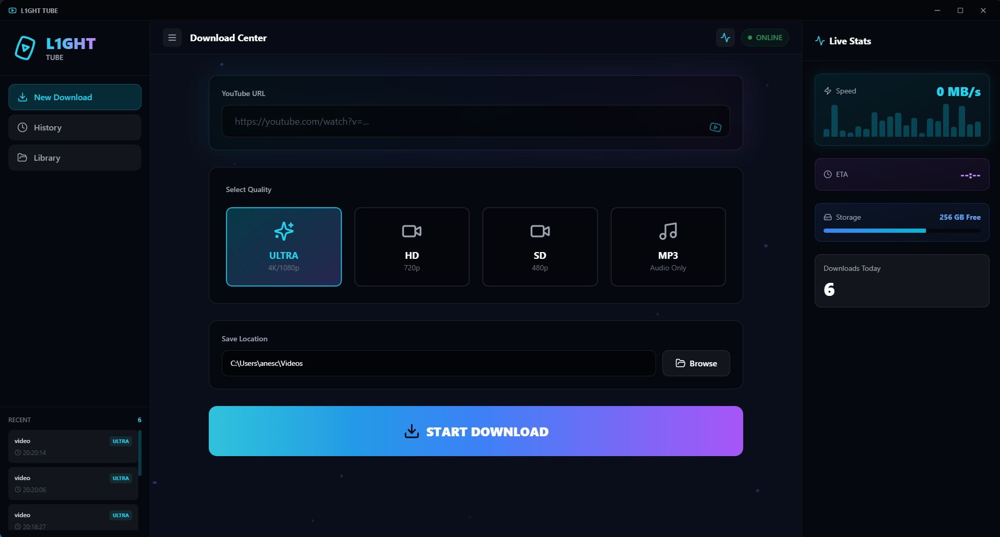

# L1ght Video Downloader

<p align="center">
  
</p>

A professional, cross-platform YouTube video downloader featuring a modern desktop UI and robust Python backend.

---

## Overview
L1ght Video Downloader is a next-generation application for downloading YouTube videos and audio in the highest available quality. It combines a beautiful, glassmorphism-inspired desktop interface with a powerful Python backend, providing both ease of use and advanced features for all users.

---

## Features
- **Modern Desktop UI:** Built with React, Tailwind CSS, and Tauri for a native feel and lightning-fast performance.
- **Multiple Quality Options:** Download in 4K, HD, SD, or audio-only (MP3).
- **Animated & Responsive Design:** Smooth transitions, live stats, and a glassmorphism look.
- **Download History & Library:** Track, manage, and access all your downloads.
- **Custom Save Location:** Choose where your files are stored.
- **Live Progress & Stats:** Real-time speed, ETA, and progress indicators.
- **Cross-Platform:** Works on Windows, macOS, and Linux.
- **Terminal & GUI:** Use as a command-line tool or a full-featured desktop app.

---

## Tech Stack
- **Frontend:** React 18, TypeScript, Vite, Tailwind CSS, Framer Motion, Lucide React
- **Desktop Shell:** Tauri (Rust)
- **Backend:** Python 3.7+, yt-dlp, FFmpeg

---

## Installation

### Prerequisites
- **Node.js** (v18 or higher): [Download Node.js](https://nodejs.org/)
- **Rust** (latest stable): [Install Rust](https://rustup.rs/)
- **Python 3.7+**: [Download Python](https://www.python.org/downloads/)
- **FFmpeg**: [Download FFmpeg](https://ffmpeg.org/download.html) (if not bundled)

### 1. Clone the Repository
```bash
git clone https://github.com/n0ur-err/L1ght_video.git
cd L1ght_video
```

### 2. Install Python Dependencies
```bash
pip install -r requirements.txt
```

### 3. Install UI Dependencies
```bash
cd ui
npm install
```

### 4. Build & Run the Desktop App
- **Development mode (hot reload):**
  ```bash
  npm run tauri:dev
  ```
- **Production build:**
  ```bash
  npm run tauri:build
  ```
  The installer will be in `ui/src-tauri/target/release/bundle/`

---

## Usage

### Desktop App
- Launch the app using the installer or `npm run tauri:dev` for development.
- Paste a YouTube URL, select quality, and start downloading.
- Access your download history and manage files from the UI.

### Terminal (Optional)
- Run the backend directly:
  ```bash
  python main.py
  ```
- Follow the prompts to download videos via the command line.

---

## Project Structure
```
L1ght_video/
├── main.py              # Python backend script
├── requirements.txt     # Python dependencies
├── ui/                  # Modern desktop UI (Tauri + React)
│   ├── src/             # React source code
│   ├── src-tauri/       # Rust backend for Tauri
│   └── ...
├── img/                 # Images and banners
│   └── img.jpg          # Project banner
└── ...
```

---

## License
This project is licensed under the MIT License.

---

## Acknowledgements
- [yt-dlp](https://github.com/yt-dlp/yt-dlp) for advanced YouTube downloading
- [FFmpeg](https://ffmpeg.org/) for media processing
- [Tauri](https://tauri.app/), [React](https://react.dev/), [Tailwind CSS](https://tailwindcss.com/), and all open-source contributors

---

<div align="center">
  <sub>Created and maintained by L1ght — Fast, beautiful, and reliable video downloading for everyone.</sub>
</div>
